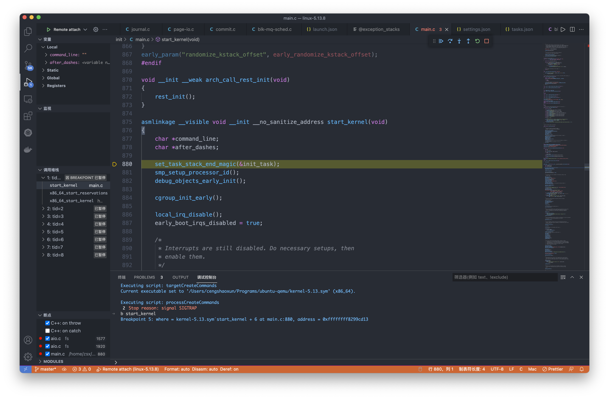

# DKernel-Plus

A Debuggable Kernel environment Plus a software collection

This tutorial describes how to set up a linux kernel debug environment on macos, if you're using linux instead, then it is even simpler to set whole things up.

## What we want

1. Debug a costomized linux kernel. "Costomized" means we could pick a kernel version as we like, or even modify the kernel's source code and compile it. "Debug" means we could set breakpoints and single step every code in the kernel just like we debug any program as usual.

2. Use the kernel as same kind of linux distribution, which means we could use a wide variety of software on it, directly compile and run programs, save the effort to statically compile the programs samewhere else and copy them into the virtual machine.

3. [Optional] Do all the stuffs in macos. If you're using linux instead, then it is even simpler to set whole things up.

4. [Optional] Visualization. For example, using same vscode extensions to directly set breakpoints in the source code line.



## How to do

The most intuitive way is to boot a linux kernel on QEMU, and use GDB or LLDB to debug it. We compile a linux kernel we want, start it on QEMU, and lauch GDB or LLDB, then we set breakpoint samewhere like `start_kernel`, and make single step executions to watch how the whole systems up.

However, this approach has some drawbacks. For example, if I want to revoke same system call and trace the kernel's calling stacks, I should statically compile a small test program in another linux environment, move the resulting .o files into the QEMU where the kernel is running, either by appending them to the `initrd` or the virtual hard disk, which causes a lot of extra effort.

So this tutorial follows another way: boot an Ubuntu image on QEMU with a given virtual hard disk, and then boot the kernel we want directly on the same hard disk. Hopefully, the kernel's filesytem would recognized all the things Ubuntu left, and thus we get a debuggable kernel without comprimising the convenience.

## Quick start

The repo contains same scripts and a pre-build linux kernel to demonstrate how to make it happen. The following parts works fine on macos Big Sur 11.4, if you're using linux, it requires only some mild changes to the scripts.

### Clone

```shell
git lfs clone https://github.com/ShaoxunZeng/DKernel-Plus.git
```

### Prerequisite

The scripts requires `docker` and `qemu` to run, you can install them using `homebrew` (on macos).

```shell
brew install docker qemu 
```

### Build the share disk

First, let's make a raw share disk for further usage.

```shell
make share-disk
```

The command would lauch a ubuntu in docker and create an ext4 raw disk.

### Boot ubuntu

Download ubuntu iso, you can directly download the iso from website or run the following command.

```shell
make ubuntu-iso
```

**NOTE**: The `Makefile` assumes the iso file name is `ubuntu-18.04-desktop-amd64.iso`, you should change it to the file name you download by modifying the `UBUNTU-ISO` in the `Makefile`.

Boot and install ubuntu in the share disk using QEMU

```shell
make ubuntu-install
```

**NOTE**: If you want to start ubuntu in the future, you could type `make ubuntu-start`.

### Boot linux kernel

Compile the kernel you want(refer to the `Compile kernel` section), copy the `initrd`, `vmlinuz` files under the `kernel` folder.

For demonstration, the `kernel` folder contains some pre-build kernel files.

**NOTE**: Change the file names in `Makefile` to the correct file name, modify the `LINUX-KERNEL` and `LINUX-INITRD` field.

```shell
make linux-start
```

Hopefully, it would boot successfully, and you could type `sudo apt update` to test it. You could write whatever you want, and use GCC to compile and run it directly.

### Debug linux kernel

Finally, debug the kernel.

```shell
make linux-debug
```

QEMU would stop and listen to port 1234 waiting for a debugger to connect. You can lauch GDB and use `target remote :1234` to test it.

If you want further debug, run the following(on macos).

```shell
make lldb
```

It will lauch a LLDB, reading the symbol file under `kernel` folder(refer to the `Compile kernel` section), map and find the correct source code in your mac, and connect to the `gdb-server` which QEMU started. Hopefully, you could debug smoothly using commandline.

**NOTE**: If you compile the kernel yourself, makesure you copy the symbol file(e.g. kernel-5.13.sym) under `kernel` folder, and `LINUX-SOURCE-PATH`, `LINUX-BUILD-PATH`, `LINUX-SYMBOL-FILE` fields in `Makefile`.

### Visualization using VSCode

Install `Native Debug` and `CodeLLDB` extensions in VSCode.

Write `lauch.json` as following.

```json
{
    "name": "Remote attach",
    "type": "lldb",
    "request": "custom",
    "targetCreateCommands": ["target create Your LINUX-SYMBOL-FILE(absolute path)"],
    "processCreateCommands": ["gdb-remote 1234"],
    "sourceMap": {"Your LINUX-BUILD-PATH" : "Your LINUX-SOURCE-PATH"}
}
```

Run `make linux-debug` and click the `Debug` in VSCode, you should see the magic happens.

## Compile kernel

This section describes how to compile a linux kernel, you could search Google for more help.

```shell
# Install the tools
apt install -y flex bison make gcc libssl-dev bc libelf-dev
# Extract
tar -xf linux-kernel.tar.gz  
cd linux-kernel
# Config
cp /boot/config-`uname -r` .config
make olddefconfig
# Set DEBUG flag
./scripts/config -e DEBUG_INFO -e DEBUG_KERNEL -e DEBUG_INFO_DWARF4
# Build kernel
make -j4
# Install modules
make modules_install -j4
# Install kernel
make install
```

You would get `vmlinuz` and `initrd` files under `/boot/`, and `vmlinux` in the source code directory.
Extract symbol file from it for LLDB load symbols.

```shell
objcopy --only-keep-debug vmlinux kernel.sym
```

## Reference

1. https://yulistic.gitlab.io/2018/12/debugging-linux-kernel-with-gdb-and-qemu/

2. https://bmeneg.com/post/kernel-debugging-with-qemu/

3. https://graspingtech.com/ubuntu-desktop-18.04-virtual-machine-macos-qemu/

4. https://stackoverflow.com/questions/11408041/how-to-debug-the-linux-kernel-with-gdb-and-qemu